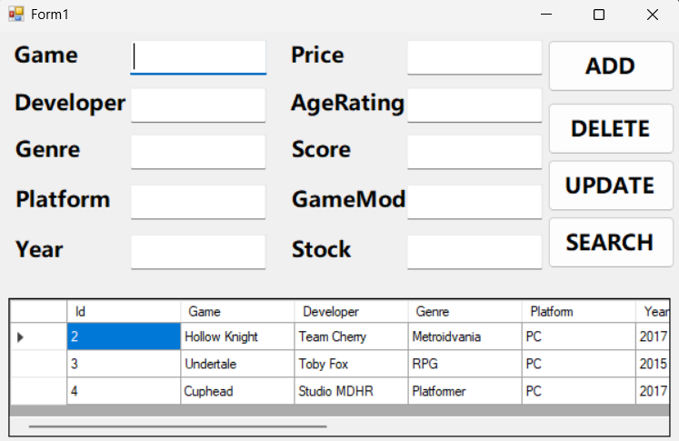

# Game Management

A simple Windows Forms application for managing a game collection.

## Features

- Add new games
- Delete games
- Update game information
- Search for games
- Display games in a DataGridView
- Store game information in a SQL Server database

## Game Information

The application stores the following information:

- Game
- Developer
- Genre
- Platform
- Year
- Price
- Age Rating
- Score
- Game Mode
- Stock

Each game also has an automatically generated ID.

## Technologies Used

- C#
- Windows Forms
- Entity Framework 6
- ADO.NET
- SQL Server
- Visual Studio
